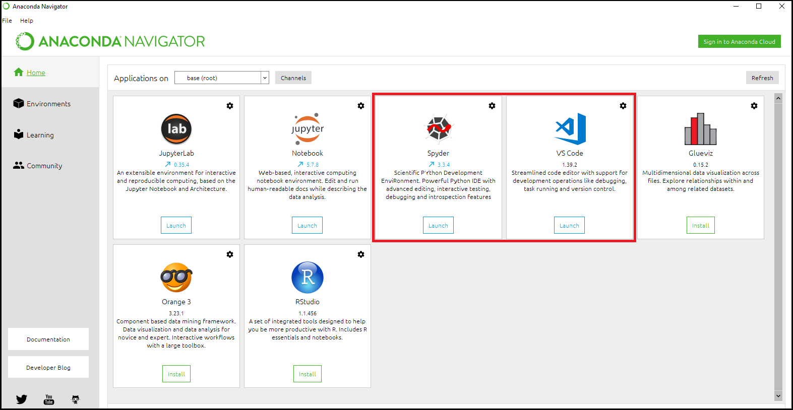

# Try Python without installation

If you want to try out the basics without installing Python and an editor on your PC, try the online interpreter in this link:
> https://www.onlinegdb.com/online_python_interpreter

Make sure to select Python 3 as language in the top right of the site.

# Installation guide
***Oct. 2019***

> ***Note:***
>_As new versions are constantly being released, this guide might not be fully up-to-date._
>_There are multiple ways of installing Python. The method described below is just one way that comes with some benefits_

## Anaconda and Miniconda
We will be using a common distribution of Python called Anaconda, which includes some benefits and pre-setup compared to installing directly from the Python website. We use a minimal installer called Miniconda, which is a lightweight version of the bigger Anaconda.

**Note:** If you already have a working installation of Python on your system that you are comfortable using, you don't need to follow this installation guide.

## 1.  Download and install Miniconda
Choose installer file with Python 3.7 that suits your Windows system from this site:
>https://docs.conda.io/en/latest/miniconda.html

In the installation section called _Advanced Installation Options_, check the box saying _Add Anaconda to my PATH environment variable_. It will say that it's not recommended, but do it anyway.


Other than this, just choose defaults for the installation.

## 2.  Install Anaconda Navigator
Go to Start, type `anaconda prompt` and open the program. Don't get scared by the DOS-look.
In the program, type
```
conda install -c anaconda anaconda-navigator
```
and press enter to install. Type `y` when it asks.


## 3.  Install an Editor

An editor is the software where the actual code is written. This could in principle be Notepad, but much more advanced editors suited for programming exist. These have syntax highlighting, auto completion while typing and much more.

This guide will focus on two editors, both of which can be installed directly from Anaconda Navigator front page:



Choose which one you like and install it from Anaconda Navigator. 
Afterwards, follow the setup as described below.

## - Visual Studio Code
Visual Studio code is a 

> [Visual Stdio Code Website](https://code.visualstudio.com/)

### Setup

Launch the editor and then:

#### 1. Go the the Extensions tab on the left panel (short key: <kbd>CTRL</kbd> + <kbd>SHIFT</kbd> + <kbd>X</kbd>)

* Make sure that the extension called `Python` is installed, which it should be already. 
*(Note that this editor supports all programming languages, not just Python)*.

* Search for and install the extension called `Code Runner`.


#### 2. Select the Python version to connect to VS Code
This might seem unnecessary, but some people have many versions of Python installed on their system.

* Go to `View` -> `Command Palette`. Write `"Python: Select Interpreter"` and choose the interpreter (there should only be one at this point):

## - Spyder
If you are used to Matlab, then **Spyder** will be a good choice. It has a variable explorer an interactive console and in general is designed to have the same feel as Matlab for scientific computing.

>[Spyder Website](https://www.spyder-ide.org/)

### Setup
